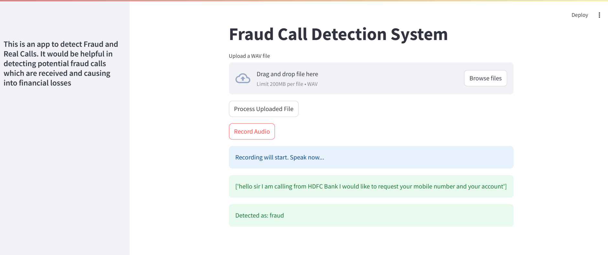

# 🚀 Fraud Call Detection

## 📌 Description
This project is a simple and efficient way to detect any fraud call by analysing the call recording of a conversation. It is designed to be **user-friendly**, **fast**, and **reliable** using Machine learning models.

## 📦 Installation
Clone this repository and install the dependencies:

```bash
git clone https://github.com/ArchitaSingh25/Fraud_Call_Detection.git
```
## 🛠️ Usage

Run the application using:

```bash
streamlit run UI.py
```
## ✨User Interface


